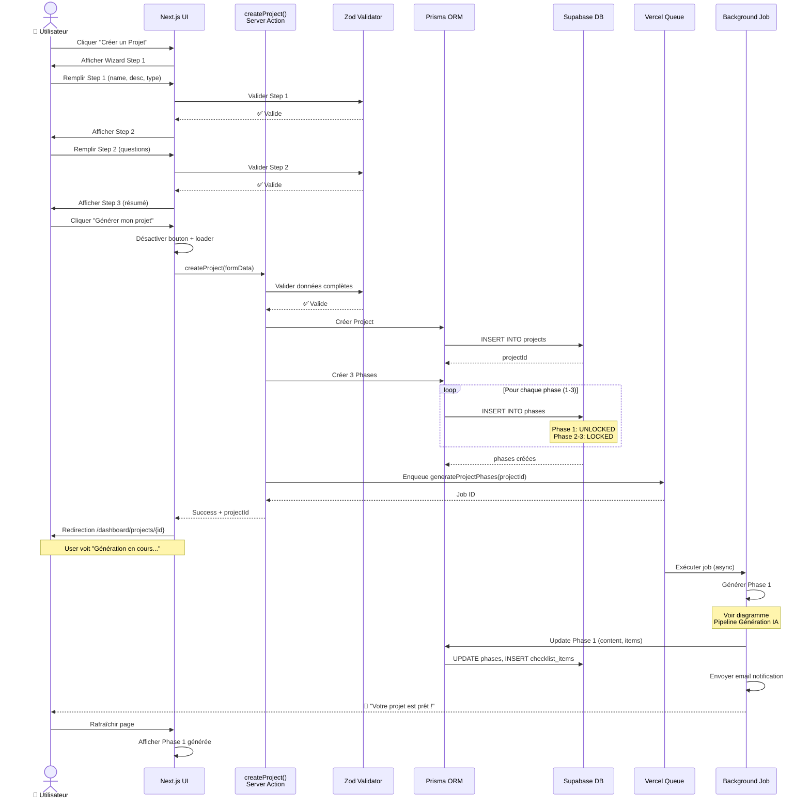
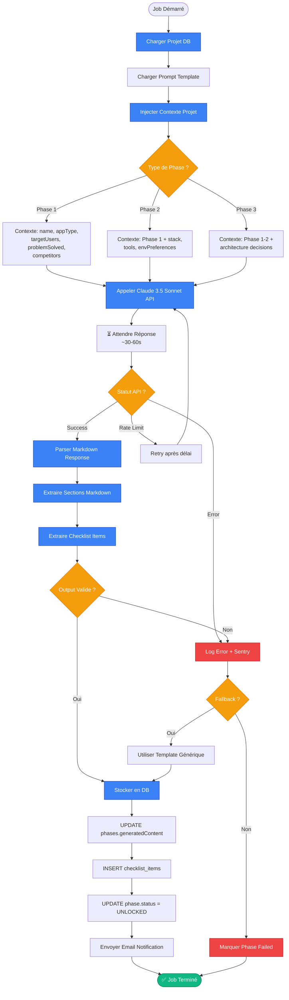
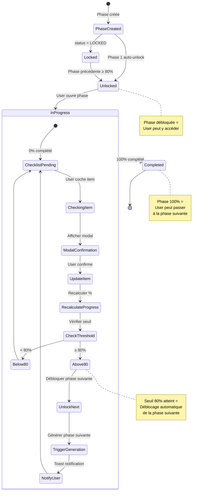
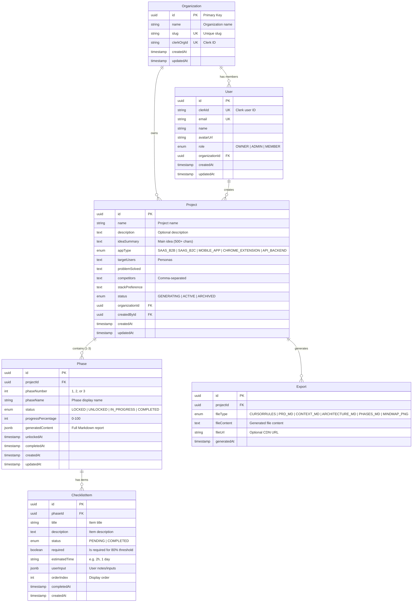
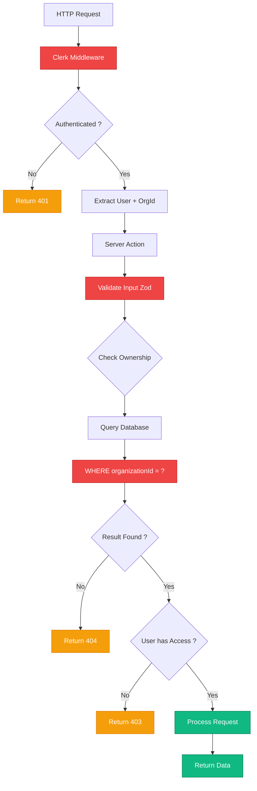

# 🏗️ DIAGRAMMES D'ARCHITECTURE - VibeFlow MVP

**Projet :** VibeFlow Platform  
**Phase :** Phase 2 - Architecture & Planification  
**Date de génération :** 28 Novembre 2025  
**Généré par :** Lead Agent (Claude Opus 4.5)  
**Statut :** Documentation Technique

---

## 📋 TABLE DES MATIÈRES

1. [Flux Utilisateur Complet](#flux-utilisateur-complet)
2. [Architecture Système Détaillée](#architecture-système-détaillée)
3. [Flow Création de Projet](#flow-création-de-projet)
4. [Pipeline de Génération IA](#pipeline-de-génération-ia)
5. [Système de Checklist & Déblocage](#système-de-checklist--déblocage)
6. [Architecture Base de Données (Détaillée)](#architecture-base-de-données-détaillée)

---

## 1. FLUX UTILISATEUR COMPLET

### Vue d'ensemble du parcours utilisateur (End-to-End)

```mermaid
flowchart TD
    Start([👤 Visiteur]) --> SignUp[Inscription Clerk]
    SignUp --> Dashboard[Dashboard Principal]
    
    Dashboard --> CreateProject{Créer un Projet ?}
    CreateProject -->|Oui| Wizard[Wizard Multi-Étapes]
    CreateProject -->|Non| ViewProjects[Liste des Projets]
    
    Wizard --> Step1[Step 1: Idée de Base]
    Step1 --> Step2[Step 2: Questions Intelligentes]
    Step2 --> Step3[Step 3: Confirmation]
    Step3 --> Submit[Soumettre]
    
    Submit --> CreateDB[Créer Projet en DB]
    CreateDB --> EnqueueJob[Enqueue Background Job]
    EnqueueJob --> Redirect[Redirection Dashboard Projet]
    
    Redirect --> WaitGeneration[⏳ Génération en cours...]
    WaitGeneration --> EmailNotif[📧 Email Notification]
    EmailNotif --> ProjectReady[✅ Projet Prêt]
    
    ProjectReady --> ViewPhase1[Voir Phase 1]
    ViewPhase1 --> Checklist[Checklist Interactive]
    
    Checklist --> CheckItem{Cocher Item ?}
    CheckItem -->|Oui| ModalConfirm[Modal Confirmation]
    ModalConfirm --> UpdateDB[Update DB]
    UpdateDB --> CalcProgress[Calculer Progression]
    
    CalcProgress --> Check80{Progression ≥ 80% ?}
    Check80 -->|Non| Checklist
    Check80 -->|Oui| UnlockPhase2[🔓 Débloquer Phase 2]
    
    UnlockPhase2 --> GeneratePhase2[Générer Phase 2]
    GeneratePhase2 --> ViewPhase2[Voir Phase 2]
    
    ViewPhase2 --> ExportDecision{Exporter ?}
    ExportDecision -->|Oui| ExportsPage[Page Exports]
    ExportDecision -->|Non| Continue[Continuer Checklist]
    
    ExportsPage --> DownloadFiles[Télécharger Fichiers]
    DownloadFiles --> CopyPrompt[Copier Premier Prompt]
    CopyPrompt --> UseCursor[📝 Utiliser dans Cursor]
    
    UseCursor --> End([🎉 Développement avec IA])
    
    ViewProjects --> SelectProject[Sélectionner Projet]
    SelectProject --> ProjectReady
    
    %% Style
    classDef userAction fill:#3b82f6,stroke:#1e40af,color:#fff
    classDef systemAction fill:#10b981,stroke:#047857,color:#fff
    classDef decision fill:#f59e0b,stroke:#d97706,color:#fff
    classDef milestone fill:#8b5cf6,stroke:#6d28d9,color:#fff
    
    class SignUp,CreateProject,CheckItem,ExportDecision userAction
    class CreateDB,EnqueueJob,UpdateDB,CalcProgress,GeneratePhase2 systemAction
    class Check80 decision
    class ProjectReady,UnlockPhase2,UseCursor,End milestone
```



---

## 2. ARCHITECTURE SYSTÈME DÉTAILLÉE

### Composants et interactions

```mermaid
graph TB
    %% User Layer
    User[👤 Utilisateur]
    
    %% Presentation Layer
    subgraph PresentationLayer["🎨 Presentation Layer (Client)"]
        Pages[Next.js Pages<br/>App Router]
        Components[React Components<br/>Shadcn UI]
        StateManagement[State Management<br/>React Server Components]
        Forms[React Hook Form<br/>+ Zod Validation]
    end
    
    %% Application Layer
    subgraph ApplicationLayer["⚙️ Application Layer (Server)"]
        ServerActions[Server Actions<br/>Type-Safe]
        APIRoutes[API Routes<br/>REST]
        Middleware[Clerk Middleware<br/>Auth Protection]
    end
    
    %% Domain Layer
    subgraph DomainLayer["🧠 Domain Layer"]
        Services[Business Services]
        Generators[File Generators]
        Parsers[Markdown Parsers]
        Validators[Zod Validators]
    end
    
    %% Infrastructure Layer
    subgraph InfrastructureLayer["🔧 Infrastructure Layer"]
        Prisma[Prisma ORM<br/>Type-Safe Queries]
        QueueSystem[Vercel Queue<br/>Background Jobs]
        AnthropicAPI[Anthropic API<br/>Claude 3.5 Sonnet]
        EmailService[Resend<br/>Transactional Emails]
    end
    
    %% External Services
    subgraph ExternalServices["🌐 External Services"]
        Clerk[Clerk Auth<br/>Organizations]
        Supabase[Supabase DB<br/>PostgreSQL 17]
        Vercel[Vercel Edge<br/>Hosting]
    end
    
    %% Monitoring
    subgraph Monitoring["📊 Monitoring"]
        Sentry[Sentry<br/>Error Tracking]
        Logs[Pino Logs<br/>Structured]
    end
    
    %% Connections
    User --> Pages
    Pages --> Components
    Components --> Forms
    Pages --> ServerActions
    Pages --> APIRoutes
    
    ServerActions --> Middleware
    APIRoutes --> Middleware
    Middleware --> Clerk
    
    ServerActions --> Services
    Services --> Generators
    Services --> Parsers
    Services --> Validators
    
    ServerActions --> Prisma
    Prisma --> Supabase
    
    ServerActions --> QueueSystem
    QueueSystem --> AnthropicAPI
    QueueSystem --> EmailService
    
    ServerActions --> Sentry
    ServerActions --> Logs
    
    Pages --> Vercel
    
    %% Styling
    classDef presentation fill:#3b82f6,stroke:#1e40af,color:#fff
    classDef application fill:#10b981,stroke:#047857,color:#fff
    classDef domain fill:#8b5cf6,stroke:#6d28d9,color:#fff
    classDef infrastructure fill:#f59e0b,stroke:#d97706,color:#fff
    classDef external fill:#ef4444,stroke:#b91c1c,color:#fff
    classDef monitoring fill:#ec4899,stroke:#be185d,color:#fff
    
    class Pages,Components,StateManagement,Forms presentation
    class ServerActions,APIRoutes,Middleware application
    class Services,Generators,Parsers,Validators domain
    class Prisma,QueueSystem,AnthropicAPI,EmailService infrastructure
    class Clerk,Supabase,Vercel external
    class Sentry,Logs monitoring
```



---

## 3. FLOW CRÉATION DE PROJET

### Séquence détaillée de création de projet



---

## 4. PIPELINE DE GÉNÉRATION IA

### Workflow de génération d'une phase



---

## 5. SYSTÈME DE CHECKLIST & DÉBLOCAGE

### Logique de déblocage progressif



---

## 6. ARCHITECTURE BASE DE DONNÉES (DÉTAILLÉE)

### Schema avec indexes et contraintes



### Indexes pour Performance

```sql
-- Organization
CREATE UNIQUE INDEX idx_org_slug ON organizations(slug);
CREATE UNIQUE INDEX idx_org_clerk_id ON organizations(clerkOrgId);

-- User
CREATE UNIQUE INDEX idx_user_clerk_id ON users(clerkId);
CREATE UNIQUE INDEX idx_user_email ON users(email);
CREATE INDEX idx_user_org_id ON users(organizationId);
CREATE INDEX idx_user_role ON users(role);

-- Project
CREATE INDEX idx_project_org_id ON projects(organizationId);
CREATE INDEX idx_project_created_by_id ON projects(createdById);
CREATE INDEX idx_project_status ON projects(status);
CREATE INDEX idx_project_created_at ON projects(createdAt DESC);
CREATE INDEX idx_project_app_type ON projects(appType);

-- Phase
CREATE INDEX idx_phase_project_id ON phases(projectId);
CREATE INDEX idx_phase_status ON phases(status);
CREATE INDEX idx_phase_number ON phases(phaseNumber);
CREATE UNIQUE INDEX idx_phase_project_number ON phases(projectId, phaseNumber);

-- ChecklistItem
CREATE INDEX idx_checklist_phase_id ON checklist_items(phaseId);
CREATE INDEX idx_checklist_status ON checklist_items(status);
CREATE INDEX idx_checklist_order ON checklist_items(orderIndex);

-- Export
CREATE INDEX idx_export_project_id ON exports(projectId);
CREATE INDEX idx_export_file_type ON exports(fileType);
CREATE INDEX idx_export_generated_at ON exports(generatedAt DESC);
```

---

## 📊 MÉTRIQUES DE PERFORMANCE CIBLES

### Temps de Réponse

| Opération | Objectif | Métrique |
|-----------|----------|----------|
| **Chargement page liste projets** | < 500ms | TTFB + FCP |
| **Chargement page détail projet** | < 800ms | TTFB + FCP |
| **Chargement page phase** | < 1s | TTFB + LCP |
| **Update checklist item** | < 300ms | Server Action latency |
| **Génération Phase 1 (Claude API)** | 30-60s | Background job duration |
| **Export file download** | < 200ms | API Route latency |

### Scalabilité

| Métrique | Objectif MVP | Objectif V2 |
|----------|--------------|-------------|
| **Concurrent users** | 100 | 10,000 |
| **Projects per org** | 10 | 1,000 |
| **Database size** | 1 GB | 100 GB |
| **API calls/min (Claude)** | 10 | 100 |
| **Background jobs/hour** | 60 | 1,000 |

---

## 🔐 SÉCURITÉ

### Principes d'Isolation Multi-Tenant



---

## 📱 RESPONSIVE DESIGN

### Breakpoints et Layout

| Breakpoint | Taille | Layout | Colonnes Grid |
|------------|--------|--------|---------------|
| **Mobile** | 320-640px | Stack vertical | 1 colonne |
| **Tablet** | 641-1024px | Grid 2 col | 2 colonnes |
| **Desktop** | 1025-1536px | Grid 3 col | 3 colonnes |
| **Large** | 1537px+ | Grid 4 col | 4 colonnes |

---

**Version :** 1.0  
**Dernière mise à jour :** 28 Novembre 2025  
**Prochaine révision :** Après implémentation Sprint 1

---

*Ces diagrammes ont été générés par le Lead Agent (Claude Opus 4.5) dans le cadre de la Phase 2 : Architecture & Planification du projet VibeFlow.*

