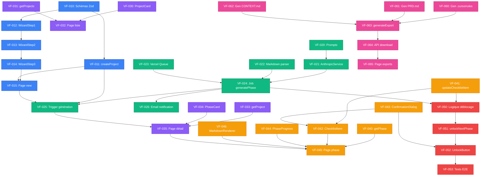

# 📋 PLAN TECHNIQUE DÉTAILLÉ - VibeFlow MVP

**Projet :** VibeFlow Platform  
**Phase :** Phase 2 - Architecture & Planification  
**Date de génération :** 28 Novembre 2025  
**Généré par :** Lead Agent (Claude Opus 4.5)  
**Statut :** Ready for Implementation

---

## 📊 TABLE DES MATIÈRES

1. [Vue d'Ensemble](#vue-densemble)
2. [Epics & User Stories](#epics--user-stories)
3. [Tickets Granulaires](#tickets-granulaires)
4. [Diagramme de Dépendances](#diagramme-de-dépendances)
5. [Roadmap 3 Sprints](#roadmap-3-sprints)
6. [Estimation Totale](#estimation-totale)

---

## 🎯 VUE D'ENSEMBLE

### Objectif MVP

Permettre à un utilisateur de :
1. ✅ Créer un compte (avec Clerk) - **COMPLÉTÉ Phase 1**
2. Créer un projet en répondant à des questions intelligentes
3. Générer automatiquement la Phase 1 (Validation Marché)
4. Visualiser le rapport Phase 1 avec checklist interactive
5. Débloquer Phase 2 après ≥80% completion Phase 1
6. Télécharger les exports Markdown (.cursorrules, PRD.md, etc.)

### Scope MVP (Phases 1-3 du Produit)

Le MVP génère **uniquement les 3 premières phases** du produit :
- **Phase 1** : Validation de Marché
- **Phase 2** : Setup & Context Engineering
- **Phase 3** : Architecture & Planification

Les phases 4-10 seront ajoutées en V2 post-validation marché.

### Technologies Utilisées

**Frontend :**
- Next.js 16.0.5 (App Router, Server Actions)
- TypeScript 5.x (strict mode)
- Tailwind CSS 4.0
- Shadcn UI
- React Hook Form + Zod

**Backend :**
- Supabase PostgreSQL 17
- Prisma 6.19.0
- Clerk Auth
- Claude 3.5 Sonnet (génération IA)

**Infrastructure :**
- Vercel (hosting + edge functions)
- Resend (emails transactionnels)
- Vercel Queue ou Inngest (background jobs)

---

## 📦 EPICS & USER STORIES

### Epic 1 : Auth & Organizations ✅ COMPLÉTÉ

**Statut :** ✅ Complété en Phase 1  
**Durée réelle :** 10 heures

**User Stories couvertes :**
- [x] US-1.1 : En tant qu'utilisateur, je peux créer un compte via Google/GitHub/Email
- [x] US-1.2 : En tant qu'utilisateur, je suis redirigé vers le dashboard après signup
- [x] US-1.3 : En tant qu'utilisateur, je peux me déconnecter
- [x] US-1.4 : En tant qu'utilisateur, les routes /dashboard sont protégées

---

### Epic 2 : Wizard Création Projet

**Durée estimée :** 12 heures  
**Complexité :** Moyenne  
**Priorité :** P0 (Critique)

**User Stories :**
- [ ] US-2.1 : En tant qu'utilisateur, je peux accéder au formulaire de création de projet
- [ ] US-2.2 : En tant qu'utilisateur, je remplis un wizard multi-étapes (3 steps)
- [ ] US-2.3 : En tant qu'utilisateur, je vois la validation en temps réel (Zod)
- [ ] US-2.4 : En tant qu'utilisateur, je peux revenir en arrière dans le wizard
- [ ] US-2.5 : En tant qu'utilisateur, je vois un récapitulatif avant de valider
- [ ] US-2.6 : En tant qu'utilisateur, mon projet est créé et stocké en DB

**Composants clés :**
- Formulaire multi-step avec React Hook Form
- Validation Zod côté client ET serveur
- Server Action `createProject()`
- Navigation entre steps

---

### Epic 3 : AI Generation Pipeline

**Durée estimée :** 16 heures  
**Complexité :** Haute  
**Priorité :** P0 (Critique)

**User Stories :**
- [ ] US-3.1 : En tant qu'utilisateur, je lance la génération des phases après création projet
- [ ] US-3.2 : En tant qu'utilisateur, je vois un loader pendant la génération (2-3 min)
- [ ] US-3.3 : En tant qu'utilisateur, je reçois un email quand la génération est terminée
- [ ] US-3.4 : En tant que système, je génère Phase 1 avec Claude 3.5 Sonnet
- [ ] US-3.5 : En tant que système, j'extrais les checklist items du rapport généré
- [ ] US-3.6 : En tant que système, je stocke le rapport et les items en DB

**Composants clés :**
- Background job system (Vercel Queue ou Inngest)
- Intégration Claude API
- Prompts templates pour Phase 1-3
- Parser de réponse Markdown
- Extraction des checklist items (regex ou AI)

---

### Epic 4 : Dashboard Projet

**Durée estimée :** 10 heures  
**Complexité :** Moyenne  
**Priorité :** P0 (Critique)

**User Stories :**
- [ ] US-4.1 : En tant qu'utilisateur, je vois la liste de mes projets
- [ ] US-4.2 : En tant qu'utilisateur, je peux accéder à un projet spécifique
- [ ] US-4.3 : En tant qu'utilisateur, je vois la progression globale du projet (% completion)
- [ ] US-4.4 : En tant qu'utilisateur, je vois la liste des 3 phases (avec statuts)
- [ ] US-4.5 : En tant qu'utilisateur, je peux naviguer vers une phase spécifique

**Composants clés :**
- Page `/dashboard/projects` (liste)
- Page `/dashboard/projects/[id]` (détail projet)
- Composant `ProjectCard`
- Composant `PhaseCard` avec progress bar
- Composant `ProjectHeader` avec stats

---

### Epic 5 : Système de Checklist Interactive

**Durée estimée :** 14 heures  
**Complexité :** Haute  
**Priorité :** P0 (Critique)

**User Stories :**
- [ ] US-5.1 : En tant qu'utilisateur, je vois la checklist de la Phase 1
- [ ] US-5.2 : En tant qu'utilisateur, je peux cocher un item de checklist
- [ ] US-5.3 : En tant qu'utilisateur, je vois une modal de confirmation avant de cocher
- [ ] US-5.4 : En tant qu'utilisateur, je peux décocher un item (avec modal)
- [ ] US-5.5 : En tant qu'utilisateur, je peux ajouter des notes à un item
- [ ] US-5.6 : En tant qu'utilisateur, la progression se met à jour automatiquement

**Composants clés :**
- Page `/dashboard/projects/[id]/phases/[phaseNumber]`
- Composant `ChecklistItem` (checkbox + description + notes)
- Server Action `updateChecklistItem()`
- Modal de confirmation (`ConfirmationDialog`)
- Calcul automatique du `progressPercentage`

---

### Epic 6 : Système de Déblocage Progressif

**Durée estimée :** 8 heures  
**Complexité :** Moyenne  
**Priorité :** P0 (Critique)

**User Stories :**
- [ ] US-6.1 : En tant qu'utilisateur, Phase 2 est bloquée tant que Phase 1 < 80%
- [ ] US-6.2 : En tant qu'utilisateur, je vois un bouton "Débloquer Phase 2" quand Phase 1 ≥ 80%
- [ ] US-6.3 : En tant qu'utilisateur, je peux débloquer Phase 2 en cliquant sur le bouton
- [ ] US-6.4 : En tant que système, je génère automatiquement Phase 2 après déblocage
- [ ] US-6.5 : En tant qu'utilisateur, je suis notifié quand Phase 2 est générée

**Composants clés :**
- Logic dans Server Action `updateChecklistItem()` pour vérifier le seuil 80%
- Server Action `unlockNextPhase()`
- Background job pour génération Phase 2
- Notification UI (toast ou banner)

---

### Epic 7 : Export System

**Durée estimée :** 10 heures  
**Complexité :** Moyenne  
**Priorité :** P1 (Haute)

**User Stories :**
- [ ] US-7.1 : En tant qu'utilisateur, je peux télécharger le rapport Phase 1 en Markdown
- [ ] US-7.2 : En tant qu'utilisateur, je peux télécharger un package complet (.zip)
- [ ] US-7.3 : En tant qu'utilisateur, je peux télécharger .cursorrules
- [ ] US-7.4 : En tant qu'utilisateur, je peux copier le "Premier Prompt Cursor"
- [ ] US-7.5 : En tant que système, je génère dynamiquement les fichiers d'export

**Composants clés :**
- Page `/dashboard/projects/[id]/exports`
- Server Action `generateExport()`
- Générateurs de fichiers :
  - `generateCursorrules()`
  - `generatePRD()`
  - `generateCONTEXT()`
  - `generateARCHITECTURE()`
- Téléchargement de fichiers (API Route `/api/projects/[id]/download`)

---

### Epic 8 : Stripe Integration (V2 - Dépriorisé)

**Durée estimée :** 12 heures  
**Statut :** 🔒 Dépriorisé pour MVP initial  
**Raison :** On teste d'abord le produit gratuitement pour valider le market-fit

**Note :** Sera implémenté dans V2 après validation MVP.

---

## 🎫 TICKETS GRANULAIRES

### 🔵 Epic 2 : Wizard Création Projet (12h)

#### VF-010 : Créer schémas Zod pour validation projet
**Description :** Définir les schémas Zod pour valider les inputs du formulaire de création de projet.

**Critères d'acceptation :**
- ✅ Schéma `projectStep1Schema` (name, description, appType)
- ✅ Schéma `projectStep2Schema` (targetUsers, problemSolved, competitors, stackPreference)
- ✅ Schéma `projectStep3Schema` (confirmation)
- ✅ Schéma global `createProjectSchema` (combinaison des 3 steps)
- ✅ Messages d'erreur en français
- ✅ Validation longueur min/max (name ≥3 char, description ≥100 char)

**Temps estimé :** 1h  
**Dépendances :** Aucune  
**Agent :** Backend Agent  
**Fichier :** `/lib/validations/project.ts`

---

#### VF-011 : Créer Server Action createProject()
**Description :** Implémenter la Server Action pour créer un projet en DB avec validation.

**Critères d'acceptation :**
- ✅ Validation Zod des inputs
- ✅ Vérification authentification Clerk
- ✅ Isolation par organizationId
- ✅ Création du projet en DB (Prisma)
- ✅ Création des 3 phases (Phase 1-3) avec status LOCKED
- ✅ Phase 1 unlocked par défaut
- ✅ Gestion d'erreurs (try/catch + messages clairs)
- ✅ Retourne le projectId

**Temps estimé :** 2h  
**Dépendances :** VF-010  
**Agent :** Backend Agent  
**Fichier :** `/app/actions/projects.ts`

---

#### VF-012 : Créer composant ProjectWizardStep1
**Description :** Premier step du wizard (Idée de Base).

**Critères d'acceptation :**
- ✅ Inputs : name (text), description (textarea), appType (select)
- ✅ Validation en temps réel avec Zod
- ✅ Affichage des erreurs sous les champs
- ✅ Bouton "Suivant" désactivé si formulaire invalide
- ✅ Design Shadcn UI (Card, Input, Textarea, Select)
- ✅ Responsive mobile-first

**Temps estimé :** 2h  
**Dépendances :** VF-010  
**Agent :** Frontend Agent  
**Fichier :** `/components/projects/ProjectWizardStep1.tsx`

---

#### VF-013 : Créer composant ProjectWizardStep2
**Description :** Deuxième step du wizard (Questions Intelligentes).

**Critères d'acceptation :**
- ✅ Inputs : targetUsers (textarea), problemSolved (textarea), competitors (text, comma-separated), stackPreference (multi-select)
- ✅ Validation en temps réel
- ✅ Boutons "Précédent" et "Suivant"
- ✅ État du wizard sauvegardé (pas de perte de données)
- ✅ Design cohérent avec Step1

**Temps estimé :** 2h  
**Dépendances :** VF-012  
**Agent :** Frontend Agent  
**Fichier :** `/components/projects/ProjectWizardStep2.tsx`

---

#### VF-014 : Créer composant ProjectWizardStep3
**Description :** Troisième step du wizard (Confirmation).

**Critères d'acceptation :**
- ✅ Affiche résumé des inputs (lecture seule)
- ✅ Temps de génération estimé affiché (2-3 min)
- ✅ Boutons "Précédent" et "Générer mon projet"
- ✅ Désactive le bouton pendant la soumission
- ✅ Affiche un loader pendant la création

**Temps estimé :** 1.5h  
**Dépendances :** VF-013  
**Agent :** Frontend Agent  
**Fichier :** `/components/projects/ProjectWizardStep3.tsx`

---

#### VF-015 : Créer page /dashboard/projects/new avec wizard
**Description :** Page contenant le wizard complet avec navigation entre steps.

**Critères d'acceptation :**
- ✅ Gère l'état global du wizard (useState ou Zustand)
- ✅ Navigation entre steps (1 → 2 → 3 → 2 → 1)
- ✅ Progress indicator (Step 1/3, 2/3, 3/3)
- ✅ Appelle createProject() au step 3
- ✅ Redirection vers `/dashboard/projects/[id]` après création
- ✅ Gestion d'erreurs avec toast notification

**Temps estimé :** 2.5h  
**Dépendances :** VF-014, VF-011  
**Agent :** Frontend Agent  
**Fichier :** `/app/dashboard/projects/new/page.tsx`

---

#### VF-016 : Ajouter bouton "Créer un Projet" sur dashboard
**Description :** Ajouter un CTA visible sur le dashboard principal.

**Critères d'acceptation :**
- ✅ Bouton "Créer un Projet" visible en haut du dashboard
- ✅ Lien vers `/dashboard/projects/new`
- ✅ Icon + text (Shadcn Button)
- ✅ Variant primary
- ✅ Mobile-friendly

**Temps estimé :** 0.5h  
**Dépendances :** Aucune  
**Agent :** Frontend Agent  
**Fichier :** `/app/dashboard/page.tsx`

---

### 🟢 Epic 3 : AI Generation Pipeline (16h)

#### VF-020 : Créer templates de prompts pour Phase 1-3
**Description :** Rédiger les prompts AI pour générer les rapports des phases 1, 2 et 3.

**Critères d'acceptation :**
- ✅ Prompt template Phase 1 (Validation Marché) avec placeholders
- ✅ Prompt template Phase 2 (Setup & Context Engineering)
- ✅ Prompt template Phase 3 (Architecture & Planification)
- ✅ Format GRCP (Goal, Rules, Context, Process)
- ✅ Exemples inclus dans les prompts
- ✅ Instructions pour extraire checklist items

**Temps estimé :** 3h  
**Dépendances :** Aucune  
**Agent :** Lead Agent (écriture manuelle)  
**Fichiers :** `/prompts/phase-1.txt`, `/prompts/phase-2.txt`, `/prompts/phase-3.txt`

---

#### VF-021 : Créer service AnthropicService
**Description :** Service pour appeler l'API Claude 3.5 Sonnet.

**Critères d'acceptation :**
- ✅ Fonction `generatePhaseReport(phaseNumber, projectContext)`
- ✅ Charge le template de prompt depuis `/prompts/phase-{n}.txt`
- ✅ Injecte le contexte projet (name, appType, targetUsers, etc.)
- ✅ Appelle Claude API avec bon modèle (claude-3-5-sonnet-20241022)
- ✅ Retourne la réponse brute (Markdown)
- ✅ Gestion d'erreurs (timeout, rate limit, API errors)
- ✅ Logs structurés (Pino)

**Temps estimé :** 2h  
**Dépendances :** VF-020  
**Agent :** Backend Agent  
**Fichier :** `/lib/services/anthropic.ts`

---

#### VF-022 : Créer parser de réponse Markdown
**Description :** Parser pour extraire les sections et checklist items du rapport généré.

**Critères d'acceptation :**
- ✅ Fonction `parsePhaseReport(markdown)` retourne `{ sections, checklistItems }`
- ✅ Extraction des titres de sections (## Section)
- ✅ Extraction des checklist items (- [ ] Item)
- ✅ Parse description, temps estimé (regex)
- ✅ Gère les cas edge (Markdown mal formé)
- ✅ Tests unitaires (5+ cas de test)

**Temps estimé :** 2.5h  
**Dépendances :** Aucune  
**Agent :** Backend Agent  
**Fichier :** `/lib/parsers/markdown.ts`

---

#### VF-023 : Configurer Vercel Queue (ou Inngest)
**Description :** Setup du système de background jobs pour génération asynchrone.

**Critères d'acceptation :**
- ✅ Inngest ou Vercel Queue configuré
- ✅ Fonction background `generateProjectPhases(projectId)`
- ✅ Retry logic (3 tentatives max)
- ✅ Timeout (10 min max)
- ✅ Logs d'exécution (start, success, error)
- ✅ Email notification après génération

**Temps estimé :** 3h  
**Dépendances :** Aucune  
**Agent :** Backend Agent  
**Fichiers :** `/lib/queue/inngest.ts`, `/app/api/inngest/route.ts`

---

#### VF-024 : Implémenter job generatePhase()
**Description :** Job qui génère une phase spécifique (1, 2 ou 3).

**Critères d'acceptation :**
- ✅ Charge les données projet depuis DB
- ✅ Appelle AnthropicService.generatePhaseReport()
- ✅ Parse le rapport avec markdown parser
- ✅ Stocke `generatedContent` dans phases.generatedContent (JSON)
- ✅ Crée les checklist_items en DB (boucle sur parsed items)
- ✅ Met à jour phase.status = 'UNLOCKED'
- ✅ Gestion d'erreurs + rollback si échec

**Temps estimé :** 3h  
**Dépendances :** VF-021, VF-022, VF-023  
**Agent :** Backend Agent  
**Fichier :** `/lib/jobs/generatePhase.ts`

---

#### VF-025 : Déclencher génération après createProject()
**Description :** Lancer le background job après création du projet.

**Critères d'acceptation :**
- ✅ Dans createProject(), après création des phases, enqueue job `generateProjectPhases(projectId)`
- ✅ Job génère Phase 1 immédiatement
- ✅ Job génère Phase 2 et 3 uniquement si déblocage progressif validé (optionnel pour MVP)
- ✅ User est redirigé vers `/dashboard/projects/[id]` sans attendre
- ✅ Message "Génération en cours..." affiché

**Temps estimé :** 1.5h  
**Dépendances :** VF-024, VF-011  
**Agent :** Backend Agent  
**Fichier :** `/app/actions/projects.ts` (modification)

---

#### VF-026 : Ajouter email notification (Resend)
**Description :** Envoyer un email quand la génération est terminée.

**Critères d'acceptation :**
- ✅ Setup Resend avec clé API
- ✅ Template email "Votre projet {name} est prêt !"
- ✅ Contenu : lien vers `/dashboard/projects/[id]`
- ✅ Envoi après génération réussie de Phase 1
- ✅ Gestion d'erreurs (email non envoyé ne bloque pas le job)

**Temps estimé :** 1h  
**Dépendances :** VF-024  
**Agent :** Backend Agent  
**Fichier :** `/lib/services/email.ts`

---

### 🟣 Epic 4 : Dashboard Projet (10h)

#### VF-030 : Créer composant ProjectCard
**Description :** Carte d'affichage d'un projet sur la liste.

**Critères d'acceptation :**
- ✅ Affiche : nom, description (tronquée), appType, createdAt
- ✅ Badge status (GENERATING, ACTIVE, ARCHIVED)
- ✅ Progress bar globale (% phases complétées)
- ✅ Boutons : "Ouvrir", "Paramètres", "Supprimer"
- ✅ Design Shadcn Card
- ✅ Responsive

**Temps estimé :** 2h  
**Dépendances :** Aucune  
**Agent :** Frontend Agent  
**Fichier :** `/components/projects/ProjectCard.tsx`

---

#### VF-031 : Créer Server Action getProjects()
**Description :** Server Action pour charger la liste des projets de l'user.

**Critères d'acceptation :**
- ✅ Vérification auth Clerk
- ✅ Filtrage par organizationId (multi-tenant)
- ✅ Include phases + checklistItems pour calculer progression
- ✅ Trie par createdAt desc (plus récents en premier)
- ✅ Retourne array de projets avec stats calculées
- ✅ Gestion d'erreurs

**Temps estimé :** 1.5h  
**Dépendances :** Aucune  
**Agent :** Backend Agent  
**Fichier :** `/app/actions/projects.ts`

---

#### VF-032 : Créer page /dashboard/projects (liste)
**Description :** Page listant tous les projets de l'utilisateur.

**Critères d'acceptation :**
- ✅ Appelle getProjects() au chargement
- ✅ Affiche grid de ProjectCard (responsive : 1 col mobile, 2 col tablet, 3 col desktop)
- ✅ Bouton "Créer un Projet" en haut
- ✅ Empty state si aucun projet ("Créez votre premier projet !")
- ✅ Loading state (skeleton)

**Temps estimé :** 2h  
**Dépendances :** VF-030, VF-031  
**Agent :** Frontend Agent  
**Fichier :** `/app/dashboard/projects/page.tsx`

---

#### VF-033 : Créer Server Action getProject()
**Description :** Server Action pour charger un projet spécifique avec toutes ses données.

**Critères d'acceptation :**
- ✅ Vérification auth + ownership
- ✅ Include phases, checklistItems, exports
- ✅ Calcule les stats (phases completed, total progress)
- ✅ Retourne 404 si projet non trouvé
- ✅ Gestion d'erreurs

**Temps estimé :** 1h  
**Dépendances :** Aucune  
**Agent :** Backend Agent  
**Fichier :** `/app/actions/projects.ts`

---

#### VF-034 : Créer composant PhaseCard
**Description :** Carte d'affichage d'une phase dans le dashboard projet.

**Critères d'acceptation :**
- ✅ Affiche : phase number, name, status (badge)
- ✅ Progress bar (% checklist items completed)
- ✅ Icon lock si phase LOCKED
- ✅ Bouton "Ouvrir" si phase UNLOCKED
- ✅ Design cohérent avec ProjectCard
- ✅ Hover effects

**Temps estimé :** 1.5h  
**Dépendances :** Aucune  
**Agent :** Frontend Agent  
**Fichier :** `/components/projects/PhaseCard.tsx`

---

#### VF-035 : Créer page /dashboard/projects/[id]
**Description :** Page de détail d'un projet avec vue d'ensemble des phases.

**Critères d'acceptation :**
- ✅ Appelle getProject(id) au chargement
- ✅ Header avec nom projet, description, stats globales
- ✅ Affiche 3 PhaseCard (Phase 1, 2, 3)
- ✅ Tabs : "Vue d'ensemble" | "Exports"
- ✅ Loading state + error state
- ✅ Breadcrumb (Dashboard > Projets > {name})

**Temps estimé :** 2h  
**Dépendances :** VF-033, VF-034  
**Agent :** Frontend Agent  
**Fichier :** `/app/dashboard/projects/[id]/page.tsx`

---

### 🟠 Epic 5 : Système de Checklist Interactive (14h)

#### VF-040 : Créer Server Action getPhase()
**Description :** Server Action pour charger une phase spécifique avec checklist.

**Critères d'acceptation :**
- ✅ Vérification auth + ownership (via project)
- ✅ Include checklistItems triés par orderIndex
- ✅ Include project (pour contexte)
- ✅ Retourne 404 si phase non trouvée ou locked
- ✅ Calcule progressPercentage
- ✅ Gestion d'erreurs

**Temps estimé :** 1.5h  
**Dépendances :** Aucune  
**Agent :** Backend Agent  
**Fichier :** `/app/actions/phases.ts`

---

#### VF-041 : Créer Server Action updateChecklistItem()
**Description :** Server Action pour cocher/décocher un item de checklist.

**Critères d'acceptation :**
- ✅ Validation input (itemId, status PENDING/COMPLETED)
- ✅ Vérification auth + ownership
- ✅ Update DB (checklistItem.status, checklistItem.completedAt)
- ✅ Optionnel : userInput (notes) sauvegardées
- ✅ Recalcule progressPercentage de la phase
- ✅ Met à jour phase.progressPercentage en DB
- ✅ Vérifie seuil 80% pour déblocage phase suivante (logique future)
- ✅ Revalidate path pour refresh UI
- ✅ Gestion d'erreurs

**Temps estimé :** 2.5h  
**Dépendances :** Aucune  
**Agent :** Backend Agent  
**Fichier :** `/app/actions/phases.ts`

---

#### VF-042 : Créer composant ChecklistItem
**Description :** Composant pour afficher un item de checklist avec checkbox.

**Critères d'acceptation :**
- ✅ Checkbox Shadcn UI (controlled)
- ✅ Titre de l'item (bold si pending, strikethrough si completed)
- ✅ Description (collapsible si longue)
- ✅ Badge "required" si required=true
- ✅ Temps estimé affiché (ex: "2h")
- ✅ Zone de notes (textarea optionnelle)
- ✅ Au clic checkbox : ouvre modal confirmation
- ✅ Appelle updateChecklistItem() après confirmation

**Temps estimé :** 3h  
**Dépendances :** VF-041  
**Agent :** Frontend Agent  
**Fichier :** `/components/phases/ChecklistItem.tsx`

---

#### VF-043 : Créer modal ConfirmationDialog
**Description :** Modal réutilisable pour confirmer actions (cocher, décocher).

**Critères d'acceptation :**
- ✅ Utilise Dialog Shadcn UI
- ✅ Props : title, description, onConfirm, onCancel
- ✅ Boutons : "Annuler" (secondary) et "Confirmer" (primary)
- ✅ Accessible (keyboard navigation, focus trap)
- ✅ Ferme après action
- ✅ Loading state sur bouton Confirmer

**Temps estimé :** 1.5h  
**Dépendances :** Aucune  
**Agent :** Frontend Agent  
**Fichier :** `/components/ui/ConfirmationDialog.tsx`

---

#### VF-044 : Créer composant PhaseProgress
**Description :** Barre de progression affichant X/Y items complétés.

**Critères d'acceptation :**
- ✅ Progress bar Shadcn UI
- ✅ Texte "X/Y items complétés (Z%)"
- ✅ Couleur change selon % (rouge <50%, orange 50-79%, vert ≥80%)
- ✅ Animation smooth lors de mise à jour
- ✅ Accessible (aria-valuenow, aria-valuemin, aria-valuemax)

**Temps estimé :** 1h  
**Dépendances :** Aucune  
**Agent :** Frontend Agent  
**Fichier :** `/components/phases/PhaseProgress.tsx`

---

#### VF-045 : Créer page /dashboard/projects/[id]/phases/[phaseNumber]
**Description :** Page de détail d'une phase avec checklist complète.

**Critères d'acceptation :**
- ✅ Appelle getPhase(projectId, phaseNumber) au chargement
- ✅ Header avec nom phase, description
- ✅ PhaseProgress en haut
- ✅ Tabs : "Checklist" | "Rapport" | "Ressources"
- ✅ Tab Checklist : liste des ChecklistItem
- ✅ Tab Rapport : affiche generatedContent (Markdown rendu en HTML)
- ✅ Tab Ressources : liste des ressources complémentaires (future)
- ✅ Bouton "Débloquer Phase 2" (si progressPercentage ≥ 80%)
- ✅ Loading state + error state
- ✅ Breadcrumb (Dashboard > Projets > {projectName} > Phase {n})

**Temps estimé :** 3h  
**Dépendances :** VF-040, VF-042, VF-044  
**Agent :** Frontend Agent  
**Fichier :** `/app/dashboard/projects/[id]/phases/[phaseNumber]/page.tsx`

---

#### VF-046 : Ajouter rendu Markdown pour rapport
**Description :** Installer et configurer une lib pour rendre le Markdown en HTML.

**Critères d'acceptation :**
- ✅ Installer `react-markdown` et `remark-gfm`
- ✅ Composant `MarkdownRenderer` qui prend `content` en props
- ✅ Styles Tailwind pour h1, h2, p, ul, code, etc.
- ✅ Support syntax highlighting pour code blocks (optionnel)
- ✅ Sanitisation HTML (prevent XSS)

**Temps estimé :** 1.5h  
**Dépendances :** Aucune  
**Agent :** Frontend Agent  
**Fichier :** `/components/ui/MarkdownRenderer.tsx`

---

### 🟡 Epic 6 : Système de Déblocage Progressif (8h)

#### VF-050 : Ajouter logique déblocage dans updateChecklistItem()
**Description :** Automatiser le déblocage de la phase suivante après 80% completion.

**Critères d'acceptation :**
- ✅ Après update de l'item, recalcule progressPercentage
- ✅ Si progressPercentage ≥ 80% ET phase suivante existe ET phase suivante est LOCKED
- ✅ Met à jour phase suivante : status = 'UNLOCKED', unlockedAt = now()
- ✅ Enqueue background job pour générer phase suivante (si pas déjà générée)
- ✅ Notification UI (toast "Phase 2 débloquée !")
- ✅ Tests unitaires (5+ cas)

**Temps estimé :** 3h  
**Dépendances :** VF-041, VF-024  
**Agent :** Backend Agent  
**Fichier :** `/app/actions/phases.ts` (modification)

---

#### VF-051 : Créer Server Action unlockNextPhase()
**Description :** Server Action manuelle pour débloquer la phase suivante (bouton UI).

**Critères d'acceptation :**
- ✅ Validation : phase courante ≥ 80%
- ✅ Vérification auth + ownership
- ✅ Update phase suivante en DB (status = 'UNLOCKED')
- ✅ Enqueue job pour génération si nécessaire
- ✅ Retourne success + message
- ✅ Gestion d'erreurs (déjà débloquée, pas de phase suivante, etc.)

**Temps estimé :** 2h  
**Dépendances :** VF-050  
**Agent :** Backend Agent  
**Fichier :** `/app/actions/phases.ts`

---

#### VF-052 : Créer composant UnlockButton
**Description :** Bouton "Débloquer Phase 2" affiché sur la page phase.

**Critères d'acceptation :**
- ✅ Affiché uniquement si progressPercentage ≥ 80%
- ✅ Disabled si phase suivante déjà UNLOCKED
- ✅ Au clic : modal confirmation ("Débloquer Phase 2 ?")
- ✅ Appelle unlockNextPhase() après confirmation
- ✅ Loading state pendant action
- ✅ Toast notification après succès
- ✅ Design : bouton primary + icon Lock/Unlock

**Temps estimé :** 2h  
**Dépendances :** VF-051, VF-043  
**Agent :** Frontend Agent  
**Fichier :** `/components/phases/UnlockButton.tsx`

---

#### VF-053 : Ajouter tests E2E pour déblocage progressif
**Description :** Tests Playwright pour vérifier le flow complet de déblocage.

**Critères d'acceptation :**
- ✅ Test : Cocher 80% des items de Phase 1 → Phase 2 débloquée
- ✅ Test : Cliquer bouton "Débloquer Phase 2" → Modal confirmation
- ✅ Test : Confirmer déblocage → Toast notification
- ✅ Test : Phase 2 devient accessible (PhaseCard cliquable)
- ✅ Tests passent sans erreur

**Temps estimé :** 1h  
**Dépendances :** VF-052  
**Agent :** Test Agent  
**Fichier :** `/tests/e2e/unlock-phase.spec.ts`

---

### 🔴 Epic 7 : Export System (10h)

#### VF-060 : Créer générateur .cursorrules
**Description :** Fonction qui génère le fichier .cursorrules dynamiquement.

**Critères d'acceptation :**
- ✅ Fonction `generateCursorrules(projectId)` retourne string
- ✅ Utilise les données projet (name, appType, stack, etc.)
- ✅ Template .cursorrules avec placeholders remplacés
- ✅ Sections : Stack, Standards, Conventions, Rules, Prompts
- ✅ Format valide (syntaxe .cursorrules)
- ✅ Tests unitaires (3+ cas)

**Temps estimé :** 2h  
**Dépendances :** Aucune  
**Agent :** Backend Agent  
**Fichier :** `/lib/generators/cursorrules.ts`

---

#### VF-061 : Créer générateur PRD.md
**Description :** Fonction qui génère le fichier PRD.md dynamiquement.

**Critères d'acceptation :**
- ✅ Fonction `generatePRD(projectId)` retourne string (Markdown)
- ✅ Sections : Vision, Problème, Solution, Personas, User Journeys, Architecture
- ✅ Utilise données projet + rapport Phase 1 généré
- ✅ Format Markdown valide
- ✅ Tests unitaires

**Temps estimé :** 2h  
**Dépendances :** Aucune  
**Agent :** Backend Agent  
**Fichier :** `/lib/generators/prd.ts`

---

#### VF-062 : Créer générateur CONTEXT.md
**Description :** Fonction qui génère le fichier CONTEXT.md dynamiquement.

**Critères d'acceptation :**
- ✅ Fonction `generateCONTEXT(projectId)` retourne string (Markdown)
- ✅ Sections : Timeline, Vision, Decisions, Current Status, Next Steps
- ✅ Utilise rapport Phase 2 (Setup) si disponible
- ✅ Format Markdown valide

**Temps estimé :** 1.5h  
**Dépendances :** Aucune  
**Agent :** Backend Agent  
**Fichier :** `/lib/generators/context.ts`

---

#### VF-063 : Créer Server Action generateExport()
**Description :** Server Action pour générer un export spécifique.

**Critères d'acceptation :**
- ✅ Validation input (projectId, fileType)
- ✅ Vérification auth + ownership
- ✅ Appelle générateur approprié selon fileType
- ✅ Stocke l'export en DB (table exports)
- ✅ Retourne fileContent
- ✅ Gestion d'erreurs

**Temps estimé :** 1.5h  
**Dépendances :** VF-060, VF-061, VF-062  
**Agent :** Backend Agent  
**Fichier :** `/app/actions/exports.ts`

---

#### VF-064 : Créer API Route /api/projects/[id]/download
**Description :** API Route pour télécharger un fichier d'export.

**Critères d'acceptation :**
- ✅ Query param : fileType (cursorrules, prd, context, etc.)
- ✅ Vérification auth + ownership
- ✅ Charge ou génère l'export
- ✅ Retourne Response avec headers appropriés (Content-Type, Content-Disposition)
- ✅ Nom de fichier : {projectName}-{fileType}.{ext}
- ✅ Gestion d'erreurs (404, 403, 500)

**Temps estimé :** 1.5h  
**Dépendances :** VF-063  
**Agent :** Backend Agent  
**Fichier :** `/app/api/projects/[id]/download/route.ts`

---

#### VF-065 : Créer page /dashboard/projects/[id]/exports
**Description :** Page listant tous les exports disponibles avec boutons téléchargement.

**Critères d'acceptation :**
- ✅ Liste des exports : .cursorrules, PRD.md, CONTEXT.md, ARCHITECTURE.md
- ✅ Bouton "Télécharger" pour chaque export
- ✅ Bouton "Télécharger Package Complet" (.zip de tous les fichiers)
- ✅ Section "Premier Prompt Cursor" avec textarea pré-remplie
- ✅ Bouton "Copier" avec feedback (toast "Copié !")
- ✅ Loading states pendant génération

**Temps estimé :** 1.5h  
**Dépendances :** VF-064  
**Agent :** Frontend Agent  
**Fichier :** `/app/dashboard/projects/[id]/exports/page.tsx`

---

## 🗺️ DIAGRAMME DE DÉPENDANCES

---

## 📅 ROADMAP 3 SPRINTS

### Sprint 1 (Semaines 1-2) : Foundation & Wizard

**Objectif :** Permettre la création de projets via le wizard

**Tickets inclus :**
- Epic 2 complet : VF-010 à VF-016 (12h)
- Epic 3 (setup) : VF-020 à VF-023 (8h)

**Durée totale :** 20 heures  
**Dates :** 29 Nov - 12 Dec 2025

**Livrables :**
- ✅ Wizard création projet fonctionnel (3 steps)
- ✅ Validation Zod côté client et serveur
- ✅ createProject() crée projet + 3 phases en DB
- ✅ Background job system configuré (Vercel Queue/Inngest)
- ✅ Templates de prompts rédigés

**Critère de succès :**
- User peut créer un projet de bout en bout
- Projet est sauvegardé en DB avec 3 phases
- Background job est enqueued

---

### Sprint 2 (Semaines 3-4) : AI Generation & Dashboard

**Objectif :** Génération automatique des phases + visualisation

**Tickets inclus :**
- Epic 3 (génération) : VF-024 à VF-026 (8h)
- Epic 4 complet : VF-030 à VF-035 (10h)
- Epic 5 (partie 1) : VF-040 à VF-044 (9.5h)

**Durée totale :** 27.5 heures  
**Dates :** 13 Dec - 26 Dec 2025

**Livrables :**
- ✅ Génération Phase 1 automatique avec Claude API
- ✅ Email notification après génération
- ✅ Dashboard liste des projets
- ✅ Page détail projet avec PhaseCards
- ✅ Composants checklist de base
- ✅ Barre de progression

**Critère de succès :**
- Phase 1 est générée automatiquement (2-3 min)
- User reçoit un email de notification
- User peut voir ses projets et leur progression
- Checklist items s'affichent correctement

---

### Sprint 3 (Semaines 5-6) : Interactivité & Exports

**Objectif :** Checklist interactive + déblocage + exports

**Tickets inclus :**
- Epic 5 (partie 2) : VF-045 à VF-046 (4.5h)
- Epic 6 complet : VF-050 à VF-053 (8h)
- Epic 7 complet : VF-060 à VF-065 (10h)

**Durée totale :** 22.5 heures  
**Dates :** 27 Dec 2025 - 9 Jan 2026

**Livrables :**
- ✅ Page phase complète avec tabs (Checklist, Rapport)
- ✅ Checklist interactive (cocher/décocher avec modal)
- ✅ Déblocage automatique Phase 2 après 80% Phase 1
- ✅ Bouton manuel "Débloquer Phase 2"
- ✅ Page exports avec téléchargements
- ✅ Générateurs .cursorrules, PRD.md, CONTEXT.md
- ✅ Tests E2E déblocage

**Critère de succès :**
- User peut cocher des items de checklist
- Progression se met à jour automatiquement
- Phase 2 se débloque après 80% completion
- User peut télécharger .cursorrules et autres exports
- Premier Prompt Cursor copiable

---

## 📊 ESTIMATION TOTALE

### Temps par Epic

| Epic | Durée | Complexité | Priorité |
|------|-------|------------|----------|
| Epic 1 : Auth & Organizations | ✅ 10h (Phase 1) | Moyenne | P0 |
| Epic 2 : Wizard Création Projet | 12h | Moyenne | P0 |
| Epic 3 : AI Generation Pipeline | 16h | Haute | P0 |
| Epic 4 : Dashboard Projet | 10h | Moyenne | P0 |
| Epic 5 : Checklist Interactive | 14h | Haute | P0 |
| Epic 6 : Déblocage Progressif | 8h | Moyenne | P0 |
| Epic 7 : Export System | 10h | Moyenne | P1 |
| **TOTAL MVP** | **70h** | - | - |

### Temps par Sprint

| Sprint | Durée | Dates | Tickets |
|--------|-------|-------|---------|
| Sprint 1 | 20h | 29 Nov - 12 Dec | VF-010 à VF-023 |
| Sprint 2 | 27.5h | 13 Dec - 26 Dec | VF-024 à VF-044 |
| Sprint 3 | 22.5h | 27 Dec - 9 Jan | VF-045 à VF-065 |
| **TOTAL** | **70h** | **6 semaines** | **40 tickets** |

### Répartition par Agent

| Agent | Durée | % du total |
|-------|-------|------------|
| Backend Agent | 30h | 43% |
| Frontend Agent | 32h | 46% |
| Test Agent | 1h | 1% |
| Lead Agent (manuel) | 3h | 4% |
| Documentation | 4h | 6% |
| **TOTAL** | **70h** | **100%** |

---

## 🎯 RECOMMANDATIONS

### Parallélisation

**Peuvent être développés en parallèle :**
- VF-010 (Backend) + VF-016 (Frontend)
- VF-020 (Lead Agent) + VF-030 (Frontend)
- VF-060, VF-061, VF-062 (tous Backend, indépendants)

**Dépendances critiques (bloquantes) :**
- VF-024 (job généra phase) dépend de VF-020, VF-021, VF-022, VF-023
- VF-045 (page phase) dépend de VF-040, VF-042, VF-044, VF-046
- VF-052 (UnlockButton) dépend de VF-051, VF-043

### Risques Identifiés

| Risque | Probabilité | Impact | Mitigation |
|--------|-------------|--------|------------|
| **Claude API rate limit** | Moyenne | Haute | Retry logic + fallback sur Gemini 3 Pro |
| **Génération trop lente (>5min)** | Moyenne | Moyenne | Optimiser prompts + streaming |
| **Parsing Markdown échoue** | Faible | Haute | Tests unitaires + fallback manuel |
| **Background jobs perdus** | Faible | Haute | Queue persistante (Inngest) + retry |
| **Webhook Clerk non testé** | Haute | Faible | Report test en production (non-bloquant MVP) |

### Optimisations Possibles

**Post-MVP (V2) :**
1. **Caching** : Cache les rapports générés (Redis)
2. **Streaming** : Afficher le rapport en temps réel pendant génération
3. **Batch generation** : Générer Phase 1-3 en parallèle (3x plus rapide)
4. **Optimisation prompts** : Réduire tokens input/output (-30% coûts)

---

## ✅ CHECKLIST DE DÉMARRAGE SPRINT 1

- [x] Phase 1 complétée (Auth & DB)
- [ ] Lire et comprendre tous les tickets du Sprint 1
- [ ] Setup Vercel Queue ou Inngest (VF-023)
- [ ] Créer les schémas Zod (VF-010)
- [ ] Rédiger les 3 prompts templates (VF-020)
- [ ] Créer la branche `sprint-1/wizard-creation-projet`

---

**Prochaine étape :** Implémenter les tickets du Sprint 1 (VF-010 à VF-023)

---

**Version :** 1.0  
**Dernière mise à jour :** 28 Novembre 2025  
**Prochaine révision :** Après Sprint 1 (ajustements estimations)

---

*Ce plan technique a été généré par le Lead Agent (Claude Opus 4.5) dans le cadre de la Phase 2 : Architecture & Planification du projet VibeFlow.*

