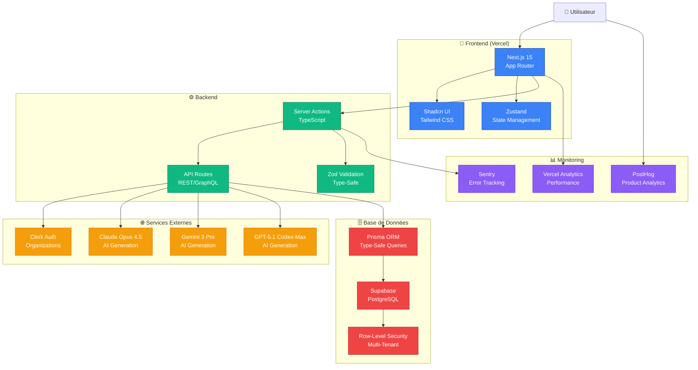
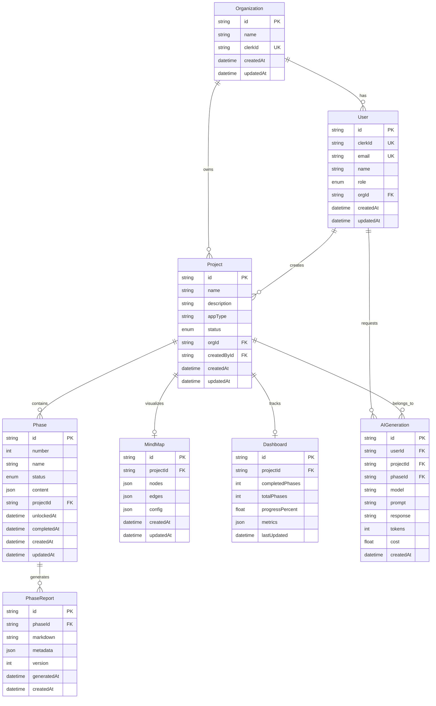
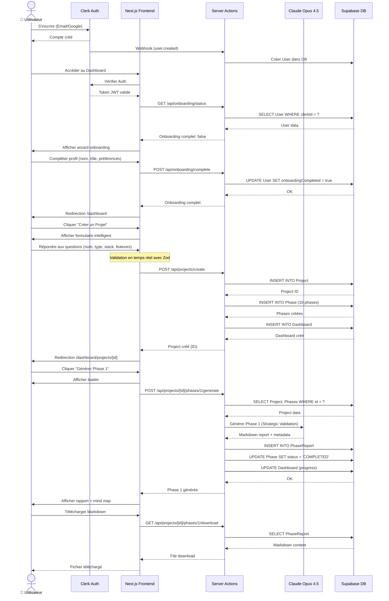
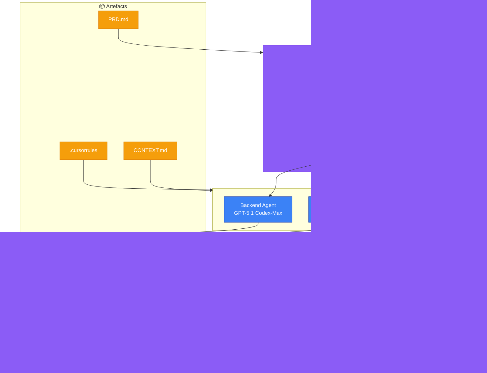

# ARCHITECTURE.md - VibeFlow

> **Documentation technique de l'architecture système, base de données et flux utilisateur**

---

## 📊 TABLE DES MATIÈRES

1. [Architecture Système Globale](#architecture-système-globale)
2. [Architecture Base de Données](#architecture-base-de-données)
3. [Flux Utilisateur Principal](#flux-utilisateur-principal)
4. [Architecture Multi-Agents](#architecture-multi-agents)
5. [Stack Technique Détaillée](#stack-technique-détaillée)

---

## Architecture Système Globale

### Vue d'ensemble (High-Level)



---

## Architecture Base de Données

### Schéma Entity-Relationship (ERD)



### Indexes & Contraintes

**Indexes critiques pour performance :**

```sql
-- Organization
CREATE UNIQUE INDEX idx_org_clerk_id ON Organization(clerkId);

-- User
CREATE UNIQUE INDEX idx_user_clerk_id ON User(clerkId);
CREATE UNIQUE INDEX idx_user_email ON User(email);
CREATE INDEX idx_user_org_id ON User(orgId);

-- Project
CREATE INDEX idx_project_org_id ON Project(orgId);
CREATE INDEX idx_project_created_by_id ON Project(createdById);
CREATE INDEX idx_project_status ON Project(status);
CREATE INDEX idx_project_created_at ON Project(createdAt);

-- Phase
CREATE INDEX idx_phase_project_id ON Phase(projectId);
CREATE INDEX idx_phase_status ON Phase(status);
CREATE INDEX idx_phase_number ON Phase(number);

-- PhaseReport
CREATE INDEX idx_report_phase_id ON PhaseReport(phaseId);
CREATE INDEX idx_report_generated_at ON PhaseReport(generatedAt);

-- MindMap
CREATE UNIQUE INDEX idx_mindmap_project_id ON MindMap(projectId);

-- Dashboard
CREATE UNIQUE INDEX idx_dashboard_project_id ON Dashboard(projectId);

-- AIGeneration
CREATE INDEX idx_ai_gen_user_id ON AIGeneration(userId);
CREATE INDEX idx_ai_gen_project_id ON AIGeneration(projectId);
CREATE INDEX idx_ai_gen_phase_id ON AIGeneration(phaseId);
CREATE INDEX idx_ai_gen_created_at ON AIGeneration(createdAt);
```

### Row-Level Security (RLS) Policies

**Isolation multi-tenant stricte via Supabase RLS :**

```sql
-- Organization: Accessible uniquement par ses membres
CREATE POLICY "org_members_only" ON Organization
FOR ALL TO authenticated
USING (
  id IN (
    SELECT orgId FROM User
    WHERE clerkId = auth.jwt() ->> 'sub'
  )
);

-- User: Accessible uniquement dans sa propre organisation
CREATE POLICY "user_same_org_only" ON User
FOR ALL TO authenticated
USING (
  orgId IN (
    SELECT orgId FROM User
    WHERE clerkId = auth.jwt() ->> 'sub'
  )
);

-- Project: Accessible uniquement aux membres de l'organisation propriétaire
CREATE POLICY "project_org_members_only" ON Project
FOR ALL TO authenticated
USING (
  orgId IN (
    SELECT orgId FROM User
    WHERE clerkId = auth.jwt() ->> 'sub'
  )
);

-- Phase: Accessible via le Project associé
CREATE POLICY "phase_via_project_access" ON Phase
FOR ALL TO authenticated
USING (
  projectId IN (
    SELECT id FROM Project
    WHERE orgId IN (
      SELECT orgId FROM User
      WHERE clerkId = auth.jwt() ->> 'sub'
    )
  )
);

-- PhaseReport: Accessible via Phase → Project
CREATE POLICY "report_via_phase_access" ON PhaseReport
FOR ALL TO authenticated
USING (
  phaseId IN (
    SELECT p.id FROM Phase p
    JOIN Project proj ON p.projectId = proj.id
    JOIN User u ON proj.orgId = u.orgId
    WHERE u.clerkId = auth.jwt() ->> 'sub'
  )
);

-- MindMap: Accessible via Project
CREATE POLICY "mindmap_via_project_access" ON MindMap
FOR ALL TO authenticated
USING (
  projectId IN (
    SELECT id FROM Project
    WHERE orgId IN (
      SELECT orgId FROM User
      WHERE clerkId = auth.jwt() ->> 'sub'
    )
  )
);

-- Dashboard: Accessible via Project
CREATE POLICY "dashboard_via_project_access" ON Dashboard
FOR ALL TO authenticated
USING (
  projectId IN (
    SELECT id FROM Project
    WHERE orgId IN (
      SELECT orgId FROM User
      WHERE clerkId = auth.jwt() ->> 'sub'
    )
  )
);

-- AIGeneration: Accessible uniquement par l'utilisateur qui l'a demandé
CREATE POLICY "ai_gen_owner_only" ON AIGeneration
FOR ALL TO authenticated
USING (
  userId IN (
    SELECT id FROM User
    WHERE clerkId = auth.jwt() ->> 'sub'
  )
);
```

---

## Flux Utilisateur Principal

### Onboarding & Création de Projet



---

## Architecture Multi-Agents

### Orchestration des Agents IA (Cursor 2.0)



### Responsabilités des Agents

| Agent | Modèle IA | Responsabilités | Inputs | Outputs |
|-------|-----------|-----------------|--------|---------|
| **Lead Agent** | Claude Opus 4.5 | - Analyse du PRD<br/>- Architecture système<br/>- Breakdown en tickets<br/>- Coordination | PRD.md, .cursorrules, CONTEXT.md | Plan technique, tickets, roadmap |
| **Backend Agent** | GPT-5.1 Codex-Max | - API Routes<br/>- Server Actions<br/>- DB Queries (Prisma)<br/>- Validation (Zod) | Tickets, schéma Prisma, .cursorrules | Code backend, migrations |
| **Frontend Agent** | Cursor Composer 1 | - Composants React<br/>- UI/UX (Shadcn)<br/>- State management<br/>- Responsive design | Tickets, design system, .cursorrules | Code frontend, composants UI |
| **Test Agent** | Claude 3.5 Sonnet | - Tests unitaires<br/>- Tests d'intégration<br/>- Tests E2E<br/>- Couverture de code | Code source, critères d'acceptance | Tests Vitest, Playwright |
| **Review Agent** | Claude Opus 4.5 | - Code quality<br/>- Sécurité<br/>- Performance<br/>- Standards | Code source, .cursorrules | Rapport de review, score |
| **Security Agent** | Claude Opus 4.5 | - Audit sécurité<br/>- Détection vulnérabilités<br/>- Isolation multi-tenant<br/>- Clés API | Code source, DB schema | Rapport sécurité, fixes |
| **Performance Agent** | GPT-5.1 | - Optimisation queries<br/>- Bundle size<br/>- Core Web Vitals<br/>- N+1 detection | Code source, metrics | Rapport performance, optimisations |

---

## Stack Technique Détaillée

### Frontend Stack

| Composant | Technologie | Version | Justification | Alternatives |
|-----------|-------------|---------|---------------|--------------|
| **Framework** | Next.js | 15.0+ | Server Actions, Turbopack, PPR | Remix, Astro |
| **Language** | TypeScript | 5.7+ | Type-safety, IntelliSense | JavaScript |
| **Styling** | Tailwind CSS | 4.0+ | Engine Rust 20x plus rapide | CSS Modules, Styled-Components |
| **Components** | Shadcn UI | Latest | Code accessible (white box) | Chakra UI, MUI |
| **Icons** | Lucide React | Latest | 1400+ icônes, tree-shakeable | Heroicons, React Icons |
| **Forms** | React Hook Form | 7.0+ | Performance, validation | Formik |
| **Validation** | Zod | 3.0+ | Type-safe runtime validation | Yup, Joi |
| **State** | Zustand | 4.0+ | Léger, simple | Redux, Jotai |
| **Dates** | date-fns | Latest | Modulaire, tree-shakeable | Moment.js, Day.js |

### Backend Stack

| Composant | Technologie | Version | Justification | Alternatives |
|-----------|-------------|---------|---------------|--------------|
| **Database** | Supabase (PostgreSQL) | Latest | SQL natif, RLS, pgvector | Firebase, PlanetScale |
| **ORM** | Prisma | 6.0+ | Type-safe, migrations auto | Drizzle, TypeORM |
| **Auth** | Clerk | Latest | Multi-tenancy natif, webhooks | NextAuth, Supabase Auth |
| **API** | Next.js Server Actions | 15.0+ | Type-safe, sécurisé | REST API, tRPC |
| **Validation** | Zod | 3.0+ | Shared with frontend | - |
| **Logging** | Pino | Latest | Structuré, performant | Winston, Bunyan |
| **Email** | Resend | Latest | Developer-friendly | SendGrid, Mailgun |
| **Storage** | Supabase Storage | Latest | Intégré DB | AWS S3, Cloudflare R2 |

### AI & ML Stack

| Composant | Technologie | Use Case | Coût (Input/Output) |
|-----------|-------------|----------|---------------------|
| **Primary** | Claude Opus 4.5 | Planning, Architecture, Debug | $3 / $15 per 1M tokens |
| **Secondary** | GPT-5.1 Codex-Max | Code generation, Refactor | $1.25 / $10 per 1M tokens |
| **Tertiary** | Gemini 3 Pro | Contexte long (2M tokens) | $2 / $12 per 1M tokens |
| **Autocomplete** | Cursor Composer 1 | IDE natif | Inclus dans $20/mois |
| **Embeddings** | text-embedding-3-small | RAG (future) | $0.02 / 1M tokens |

### DevOps & Monitoring Stack

| Composant | Technologie | Use Case | Pricing |
|-----------|-------------|----------|---------|
| **Hosting** | Vercel | Frontend + Edge Functions | $20/mois (Pro) |
| **CI/CD** | GitHub Actions | Tests, Build, Deploy | 2000 min/mois gratuits |
| **Error Tracking** | Sentry | Erreurs frontend + backend | $26/mois (Team) |
| **Analytics** | Vercel Analytics | Performance, Core Web Vitals | Inclus Vercel Pro |
| **Product Analytics** | PostHog | User behavior, funnels | $0 (self-hosted) ou $450/mois |
| **Uptime Monitoring** | Better Uptime | Alertes downtime | $10/mois |
| **Domain** | Vercel Domains | DNS management | $20/an |

---

## Sécurité & Compliance

### Principes de Sécurité

1. **Isolation Multi-Tenant**
   - Row-Level Security (RLS) sur toutes les tables
   - Filtrage par `orgId` dans toutes les requêtes
   - Pas de requêtes cross-organization possibles

2. **Authentification & Autorisation**
   - Clerk gère l'auth (JWT tokens)
   - Middleware protège toutes les routes `/dashboard` et `/api`
   - Vérification auth dans toutes les Server Actions

3. **Validation des Inputs**
   - Schémas Zod côté client ET serveur
   - Sanitisation des inputs HTML (DOMPurify)
   - Rate limiting sur les endpoints publics

4. **Secrets Management**
   - Aucune clé API dans le code client
   - Variables d'environnement séparées (`.env.local`, `.env.production`)
   - Rotation des secrets tous les 90 jours

5. **HTTPS & Encryption**
   - HTTPS obligatoire (Vercel)
   - Encryption at rest (Supabase)
   - Encryption in transit (TLS 1.3)

### Compliance RGPD

- **Consentement explicite** avant collecte de données personnelles
- **Droit à l'oubli** : Endpoint `/api/user/delete` (soft delete + anonymisation)
- **Export des données** : Endpoint `/api/user/export` (JSON)
- **DPO** : Email `dpo@vibeflow.dev` pour demandes RGPD

---

## Performance & Scalabilité

### Objectifs de Performance

| Métrique | Objectif | Mesure |
|----------|----------|--------|
| **LCP (Largest Contentful Paint)** | < 2.5s | Core Web Vitals |
| **FID (First Input Delay)** | < 100ms | Core Web Vitals |
| **CLS (Cumulative Layout Shift)** | < 0.1 | Core Web Vitals |
| **Time to First Byte (TTFB)** | < 600ms | Vercel Analytics |
| **API Response Time (p95)** | < 200ms | Sentry Performance |
| **Database Query Time (p95)** | < 50ms | Prisma Metrics |
| **Bundle Size (Initial)** | < 300KB | Webpack Bundle Analyzer |

### Stratégies d'Optimisation

1. **Code Splitting**
   - Lazy loading des routes non critiques
   - Dynamic imports pour composants lourds
   - Chunking intelligent (Turbopack)

2. **Caching**
   - Server Components avec React cache()
   - Revalidation incrémentale (ISR)
   - CDN caching (Vercel Edge Network)

3. **Database**
   - Indexes sur colonnes fréquemment requêtées
   - Connection pooling (Prisma)
   - Read replicas (Supabase Pro)

4. **Images**
   - next/image avec optimization auto
   - Format WebP avec fallback JPEG
   - Lazy loading below the fold

---

**Version :** 1.0  
**Dernière mise à jour :** 28 Novembre 2025  
**Prochaine révision :** Après Phase 2 (Architecture détaillée)
